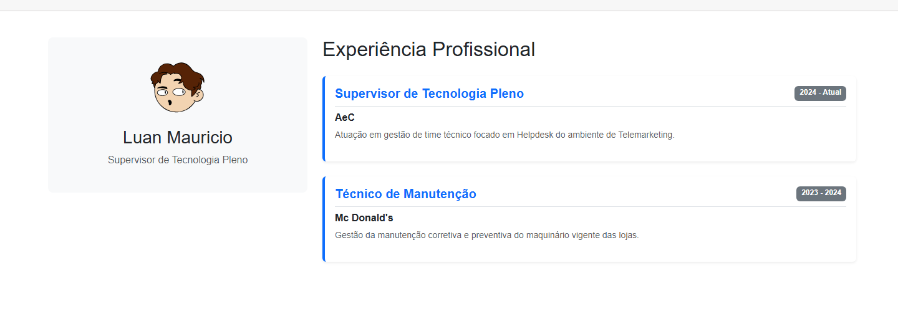

# Meu Currículo - Blazor

## Identificação

**Nome:** Luan Mauricio
**Curso:** Ciência da Computação

---

## Guia de Execução

Siga os passos abaixo para rodar o projeto via terminal:

```bash
# Clone o repositório
git clone https://github.com/SEU_USUARIO/SEU_REPOSITORIO.git

# Acesse a pasta do projeto
cd MeuCurriculo/MeuCurriculo

# Restaure as dependências
dotnet restore

# Execute o projeto
dotnet run
```

Após executar, acesse no navegador:

```
https://localhost:xxxx
```

(A porta será exibida no terminal)

---

## Tecnologia Utilizada

* .NET 8 / .NET 9 (ajuste conforme seu projeto)
* Blazor
* C#

---

## Screenshot

Abaixo está um print da aplicação em funcionamento:



---

## Heurística: Ajuda e Documentação

O sistema foi desenvolvido com foco em simplicidade e usabilidade, permitindo que o usuário navegue e compreenda suas funcionalidades sem a necessidade de documentação prévia.

Ainda assim, caso necessário:

* A estrutura do projeto é organizada e intuitiva
* Os componentes seguem padrões claros de nomenclatura
* O código é legível e de fácil manutenção

A documentação pode ser facilmente acessada diretamente no repositório, facilitando o entendimento das funcionalidades e fluxos da aplicação.
